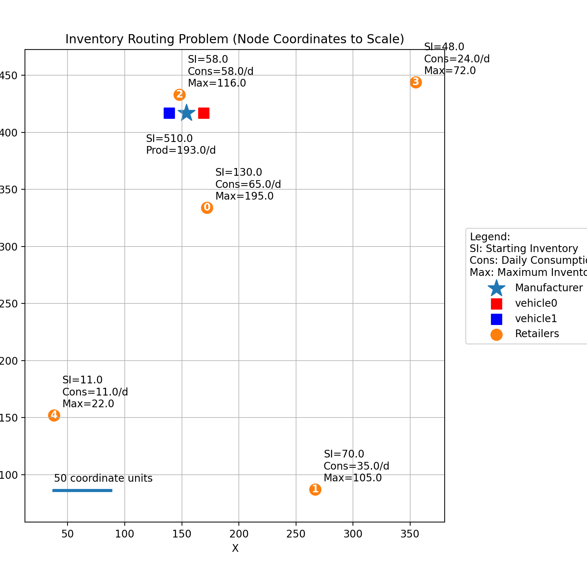

# Inventory Routing Problem (IRP) Definition

The Inventory Routing Problem (IRP) in this simulation is a coordinated supply chain challenge where a manufacturer must distribute a single product to multiple retailers over a multi-day period. The primary objective is to manage the flow of goods to avoid stockouts at the retailers while minimizing the combined costs of holding inventory and transporting products.

{width=50%}

*The figure above shows a typical IRP scenario with one manufacturer, five retailers (Nodes 0-4), and two vehicles. Each node is labeled with its starting inventory (SI), daily consumption or production rate (Cons/Prod), and maximum inventory capacity (Max).*

## Core Rules and Element Behaviors

The simulation is governed by specific rules for each of the three primary elements: the Manufacturer, the Retailers, and the Vehicles.

### 1. The Manufacturer
The manufacturer is the source of all products in the system and acts as the central coordinator for deliveries.

*   **Production**: The manufacturer produces a fixed amount of product every day (`dailyProduction`). This inventory is added to its current stock at 11:59 PM daily.
*   **Inventory Holding**: Like retailers, the manufacturer incurs a daily cost for holding inventory. The goal is to keep this inventory as low as possible by shipping products out.
*   **Scheduling**: The manufacturer receives a predefined delivery schedule and is responsible for "loading" vehicles at 6:00 AM daily. It subtracts the total amount loaded from its current inventory and posts the routes to the respective vehicles.
*   **Returns**: If a vehicle returns to the manufacturer with undelivered products (e.g., due to time constraints or capacity issues), the manufacturer accepts these returns and adds them back to its inventory.

### 2. Retailers (Nodes 0-4)
Retailers are the end points of the supply chain, each with its own consumption pattern and storage limits.

*   **Consumption**: Each retailer consumes a fixed amount of product daily (`dailyConsumption`). This consumption reduces the retailer's inventory level at 4:00 PM closing time each day.
*   **Inventory Capacity**: Every retailer has a `maxInventory` limit. If a delivery exceeds this capacity, this will be recorded in the system output.
*   **Safety Stock**: Retailers also have a `minInventory` target. While the simulation continues even if inventory drops below this level, it is considered a performance failure and may be logged as an error or reflected in higher costs.
*   **Cost Reporting**: Retailers report their daily holding costs daily at closing time based on their current inventory level and a site-specific unit cost.

### 3. Vehicles
Vehicles are the mobile agents that bridge the gap between the manufacturer and the retailers.

*   **Capacity**: Each vehicle has a strictly enforced `vehicleCapacity`. A single vehicle cannot carry more than its maximum load at any time.
*   **Speed and Travel**: Vehicles move between nodes at a constant `vehicleSpeedKmHr`. The travel time between any two nodes is calculated based on the Euclidean distance between their coordinates.
*   **Operating Hours**: Vehicles can only operate during "business hours." If a vehicle cannot reach its next destination and return to the manufacturer before the `CLOSING_HOUR`, it must abort its remaining deliveries and return home early.
*   **Transportation Cost**: Every kilometer traveled incurs a `vehicleCostPerKm`. The vehicle tracks its total daily travel distance and reports the corresponding transportation cost at the end of its shift.

## Simulation Objective

The success of a simulation run is measured by the **Total Cost**, which is the sum of:
1.  **Total Inventory Holding Cost**: The sum of daily holding costs across all retailers and the manufacturer.
2.  **Total Transportation Cost**: The sum of costs incurred by all vehicles for the distance they traveled.

The challenge of the IRP is to find a delivery schedule that balances these two competing costs: frequent small deliveries keep retailer inventory low (low holding cost) but increase travel distance (high transportation cost), while infrequent large deliveries reduce travel (low transportation cost) but require higher inventory buffers (high holding cost).
